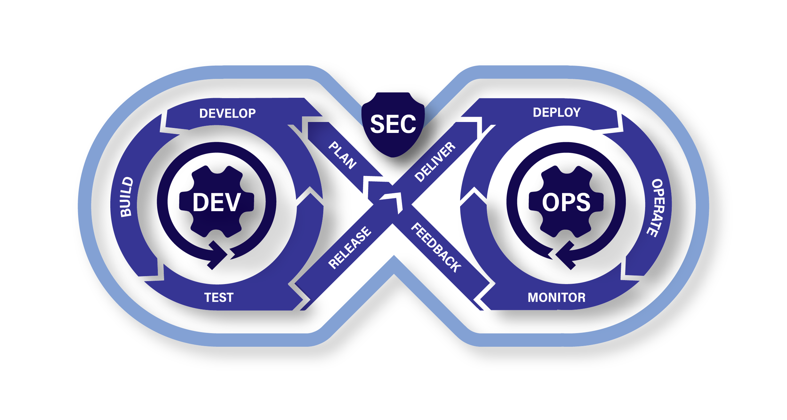

# **Welcome to the United States Department of Defense's #AI4SDLC Site**

## **The Future of Software Development in the DoD Starts Here**

Artificial Intelligence (AI) is reshaping how software is designed, built, tested, and deployed. In the DoD, where security, compliance, and mission impact are paramount, AI must be **harnessed responsibly, strategically, and effectively.**

\#AI4SDLC is your **playbook for integrating AI into the Software Development Lifecycle (SDLC)**—providing clear, actionable guidance tailored to **DoD software value streams.** Whether you’re a **developer, security engineer, acquisition professional, or program manager**, this is where you’ll find the insights and strategies to make AI work **for** mission success.  

Our goal is to provide **practical guidance** while also linking to **relevant and helpful content from across the DoD and industry**, helping teams can access the latest policies, frameworks, and best practices.  

----

##  **\#AI4SDLC?**
AI is already transforming software engineering, but the **DoD can’t afford to adopt AI blindly.** To be effective, AI integration must align with:

- **Mission Readiness** – AI must enhance, not disrupt, DoD software pipelines.  
- **Security & Compliance** – AI tools must meet strict **DoD security standards** and Zero Trust principles.  
- **Human-AI Teaming** – AI should augment and empower **software teams, not replace them.**  
- **Operational Resilience** – AI models must be **governable, explainable, and adaptable** to DoD requirements.  

 **That’s where #AI4SDLC comes in.** We deliver **practical, tested plays** to guide AI adoption at every stage of the SDLC. What's more important is that we are collaborating with programs across the DoD making sure our hands on guidance aligns with their on-the-ground experiences.

----

## What is Generative AI?

Generative AI (GenAI) refers to artificial intelligence systems—typically large language models (LLMs)—that can generate new content in response to natural language prompts. Unlike traditional AI that classifies, detects, or predicts within defined rules, GenAI can produce human-readable code, text, infrastructure scripts, documentation, diagrams, and even test cases.

In the context of the SDLC, GenAI acts as an *amplifier for human intent*. Engineers and analysts describe what they want, and the GenAI tool attempts to generate a working solution. When properly integrated and governed, this can reduce toil, accelerate scaffolding, and improve documentation quality.

However, GenAI is not magic—it introduces new forms of error, creates verification challenges, and shifts the role of developers and engineers from creators to reviewers. It requires intentional design and oversight to ensure alignment with mission needs, security standards, and operational constraints.

----

## GenAI's Impact Across the Software Value Stream

Generative AI isn't just a tool for writing code—it is reshaping the entire software development value stream, from initial concept to deployed operations. Its potential and pitfalls extend well beyond individual developer productivity.

When thoughtfully integrated, GenAI supports:

- **Requirements Engineering** - Accelerates the transformation of stakeholder intent into structured, testable user stories or models. Prompts can be used to generate acceptance criteria, identify edge cases, or translate between technical and non-technical language.

- **Architecture and Design**  - Assists with documenting system context, suggesting interface definitions, creating UML sketches, and even proposing architectural tradeoffs based on past designs or known patterns.

- **Development and Testing** - Generates boilerplate code, test scaffolding, and documentation. Code suggestions can speed up delivery, but they also introduce new risks—requiring human review, security scanning, and traceability.

- **Deployment and Sustainment** - Produces configuration files (e.g., Dockerfiles, CI/CD YAML), infrastructure-as-code templates, and observability scripts. GenAI can also assist in identifying performance tuning issues or log pattern anomalies.

- **Validation and Compliance** - Helps draft documentation, security policies, SBOM entries, and regulatory artifacts. Can be used to cross-check outputs against known standards—though human validation remains essential.

> The result is not just faster delivery—but **new interaction models, trust boundaries, and workforce behaviors** across the SDLC. This site helps teams navigate these shifts securely and responsibly.

## Playbook Orientation

### What You’ll Find Here

Each **Play** in #AI4SDLC provides structured, no-nonsense guidance on adopting AI in secure, scalable, and mission-driven ways. Our plays cover:

- **Hosting AI** – Should you run AI **on-prem, in the cloud, or hybrid?** We break it down.  
- **AI for Development** – AI copilots, IDE plugins, and agentic workflows—**what works for DoD teams?**  
- **Security & Trust** – How to **govern AI tools, mitigate risk, and enforce compliance** without slowing innovation.  
- **AI for DevSecOps** – Automating testing, security, and compliance while maintaining **human oversight**.  
- **Operational Impact** – AI isn’t just a tool—it’s part of **your mission execution strategy.**

**No fluff. No hype. Just clear, actionable guidance.**

We also provide foundational knowledge to support teams across roles—whether you’re AI-curious or building for mission-critical environments. Topics include prompting, human-machine teaming, DevSecOps integration, and trust calibration.

### Available and Upcoming Plays

This guidance is structured as a series of modular “plays,” each focused on a specific aspect of AI-augmented software engineering:

####  Available Plays

- **Home / Basics** – Terminology, responsible AI use, and the case for action  
- **Fundamentals for Designing an AI-Augmented Tool Chain** – Foundational interaction and integration patterns  
- **Code Generation & Completion** – Leading practices, risks, and DevSecOps alignment for GenAI-driven authoring  

#### Upcoming Plays

- **Governance for Responsible GenAI Adoption**  
- **Building an AI-Augmented Workforce**  
- **Risk Reference Companion**  
- **Futures Watch: Agentics and Emerging Practices**

Each play is designed to stand alone while reinforcing shared principles—so you can start where it matters most to your team or mission.

----

## Human-Machine Teaming Themes

AI augmentation isn’t just a tooling upgrade—it’s a shift in how humans and machines collaborate across the software lifecycle. As organizations adopt GenAI, they must address more than integration and governance—they must rethink roles, decision-making, and trust.

The following themes appear throughout the AI4SDLC plays and reflect critical human-centric issues teams must face when responsibly using GenAI in secure, mission-aligned environments:

### Shifting Roles: From Creators to Reviewers

GenAI shifts human work from hand-coding to reviewing, prompting, and validating machine-suggested outputs. This changes team dynamics, responsibilities, and required skills.  
[Read more → TBD]

### Cognitive Overload and Prompting Fatigue

As teams adopt GenAI, developers and engineers are experiencing decision fatigue from unclear outputs, inconsistent prompting results, and lack of context. Effective prompting strategies and human-in-the-loop workflows are essential.  
[Read more → TBD] 

### Calibrated Trust and Human Oversight

Trusting AI-generated outputs is not binary. Teams must design workflows that ensure the right level of human oversight based on risk, criticality, and system phase.  
[Read more → TBD]

### Human-Machine Interaction Patterns

As teams integrate GenAI into their workflows, they aren't just choosing tools—they're defining how humans and machines collaborate. From standalone web interfaces to agentic platforms, each interaction pattern affects traceability, trust, and governance. Whether you're prompting in an IDE, using an AI-first workspace, or delegating tasks to autonomous agents, it's critical to architect the right level of human oversight.  
[Read more → TBD]

----

## **Who Should Use This Playbook?**
This isn’t just for software developers. If you’re part of **any software value stream** in the DoD, AI is already impacting your world.

- **Developers & Engineers** – AI-powered tools to accelerate coding & debugging.  
- **Security & Compliance Teams** – AI governance & risk mitigation strategies.  
- **Program & Acquisition Managers** – Links to Guidance on AI adoption and procurement within DoD policies.  
- **AI Researchers & Policy Leaders** – Insights into AI’s evolving role in DoD software.  

**If AI touches your software mission, #AI4SDLC is for you.**

---

## **Get Started with #AI4SDLC**

1. **Explore Plays** – Browse AI guidance tailored for DoD SDLC.  
2. **New to AI in DoD? Start Here** – Foundational insights to build your knowledge.  
3. **Latest AI Trends** – Emerging AI use cases shaping DoD software development.  

**AI is not the future. It’s now.** Equip yourself with the right strategies to make it work for DoD missions.

**Mission-driven. Security-first. AI-powered.** Welcome to #AI4SDLC.

