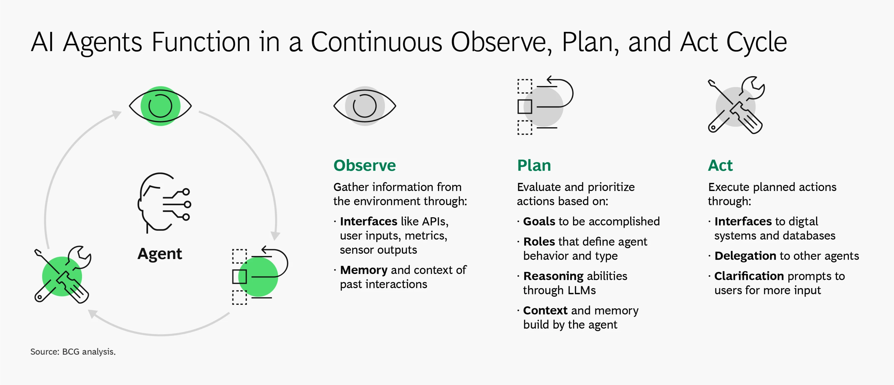

---
# automatic badge generation
lifecycle: beta
last_updated: "2025-07-15"
---
# **Play: Navigating the AI Autonomy Continuum**

## **Executive Summary (The Play in Brief)**

AI in the SDLC isn't a binary leap from "manual" to "fully automated." It's a **continuum of AI autonomy patterns** — from assistive tools embedded in workflows to self-optimizing ecosystems capable of continuous innovation.  

This play provides a **DoD-aligned framework** for understanding **four AI autonomy patterns** that exist along this continuum, helping leaders architect secure, mission-aligned systems while maintaining calibrated trust. Unlike traditional maturity models that suggest linear progression, these patterns can be implemented simultaneously across different SDLC workflows based on mission requirements, risk tolerance, and operational context.

Each pattern along the autonomy continuum has distinct architectural, governance, and workforce implications. Organizations can operate multiple patterns in parallel — using assistive tools for sensitive code while deploying orchestrated agents for CI/CD pipelines. Selecting the wrong pattern for a given workflow, or implementing patterns without proper readiness, can create mission risk, security gaps, and compliance challenges.

* **Intended audience:** CIOs, Chief Engineers, Program Managers, Software Factory Architects, DevSecOps Leads, AI/ML Engineers, Policy Makers

* **Key takeaway:** The AI autonomy continuum offers multiple patterns that can coexist. Success depends on matching the right pattern to the right workflow — autonomy is earned through readiness, not granted through technology adoption.

----

## **1. Why This Play Matters**

* DoD and federal agencies face pressure to leverage AI for speed, adaptability, and scale.
* Selecting inappropriate AI autonomy patterns for specific workflows risks security, compliance, and operational stability.
* A structured continuum of patterns helps teams make mission-aligned decisions and implement AI capabilities with confidence.

## **2. What is Autonomy and What is an AI Agent?**

### 2.1 What is AI Autonomy? 

AI Autonomy is the ability of an artificial intelligence system to operate and make decisions with minimal or no human intervention. Autonomy describes the degree to which a system can sense its environment, plan actions, and execute them without continuous human input.

Over the past fifty years, multiple taxonomies have emerged to describe levels of autonomy across domains such as avionics, manufacturing, and power systems. These taxonomies generally range from **no automation** (full reliance on humans) to **full automation** (a system acting entirely on its own within expected contexts).

* **NIST ALFUS Framework**: NIST’s Autonomy Levels for Unmanned Systems (ALFUS) describes autonomy in terms of context complexity, human independence, and mission capability [^NIST-alfus].
* **DoD Levels of Autonomy (LOA):** The Department of Defense defines autonomy in operational systems with an emphasis on governance, human–machine teaming, and mission risk.

>📌 *Key insight: Most existing taxonomies emphasize “automation” rather than “teaming.” For the SDLC, our focus is on autonomy as part of **human–AI collaboration**, not replacement.*

[^NIST-alfus]: National Institute of Standards and Technology, *Autonomy Levels for Unmanned Systems (ALFUS) Framework, Volume I: Terminology*, NIST Special Publication 1011, Version 1.1, Sep. 2004. [Online]. Available: https://www.nist.gov/system/files/documents/el/isd/ks/NISTSP_1011_ver_1-1.pdf. [Accessed: Aug. 18, 2025].

### 2.2 What is an AI Agent?

For the purpose of this play, we define an **AI Agent** as:

> *A software system that can interact with its environment, gather information, and use that information to plan and execute actions in pursuit of goals, often with some degree of autonomy.*

Key properties:

* **Observation**: Agents interface with APIs, data, metrics, or user inputs, often with memory of past interactions.
* **Planning**: Agents reason about goals, constraints, and roles, using models such as LLMs for reasoning or domain-specific logic.
* **Action**: Agents act by calling tools, updating code or artifacts, delegating to other agents, or prompting humans for clarification.[^BCG]

[^BCG]: Boston Consulting Group, "AI Agents: What They Are and Their Business Impact," BCG, Apr. 2025. [Online]. Available: https://www.bcg.com/capabilities/artificial-intelligence/ai-agents. [Accessed: Aug. 18, 2025].

#### Expert Perspectives

Different communities frame AI agents through complementary lenses:

Researchers like Masterman et al. define agents as “entities able to plan and take actions to execute goals.”[^masterman] MITRE experts build on this, with Dr. Peter Schwartz emphasizing that agents should be judged by what they do, not how they do it. Dr. Keith Miller extends this view, describing agentic systems as ranging from simple copilots to orchestrated multi-agent collectives with shared awareness of state, beliefs, and goals.

For this play, we focus on **AI Agents that leverage LLMs**, while recognizing that smaller or domain-specific agents may not require LLMs.

[^masterman]:Masterman, T., Besen, S., Sawtell, M., & Chao, A. (2024). The Landscape of Emerging AI Agent Architectures for Reasoning, Planning, and Tool Calling: A Survey (No. arXiv:2404.11584). arXiv. https://doi.org/10.48550/arXiv.2404.11584

#### **Evolution of Intelligent Agents**

The progression of intelligent agents parallels the SDLC’s increasing automation — from static helpers to adaptive collaborators.

* **1950s–1970s: Rule-Based Systems** - 
Early expert systems like MYCIN followed hard-coded *if–then* rules. They were predictable but brittle, with no learning.[^mycin]

  *SDLC Parallel:* Early **linters and static checkers** that flagged rule violations without adapting to context.

* **1980s–1990s: Adaptive Agents** - 
  Machine learning and reinforcement learning introduced adaptability, enabling agents to refine behavior from data and feedback.[^RLearn]
  
  *SDLC Parallel:* **Bug prediction models** that learned from historical commit data to anticipate likely error-prone code.

* **2000s–2010s: Deep Learning and Context Awareness** - 
  Deep neural networks allowed agents to process unstructured data (text, images, speech) and recognize patterns across large contexts.[^cnn]
  
  *SDLC Parallel:* **Automated anomaly detection** in CI/CD pipelines, identifying unusual build failures or performance regressions.

* **2018–Present: LLMs and Multi-Agent Systems** - 
  Large Language Models unlocked reasoning, planning, and natural language interaction. Agents now collaborate in multi-agent systems, coordinating tasks across the SDLC.[^fewshot]
  
  *SDLC Parallel:* **Code copilots and orchestrators** that generate, review, and integrate code, or coordinate multiple agents in DevSecOps pipelines.

📌 **Key Insight:**
The trajectory is clear: from deterministic **rule-followers** → adaptive **learners** → context-aware **analyzers** → reasoning **collaborators**. This same arc defines the autonomy continuum and the patterns we now apply to the SDLC.

[^mycin]:E. H. Shortliffe, *Computer-Based Medical Consultations: MYCIN*. New York, NY, USA: Elsevier, 1976.
[^RLearn]: R. S. Sutton and A. G. Barto, *Reinforcement Learning: An Introduction*. Cambridge, MA, USA: MIT Press, 1998.
[^cnn]: A. Krizhevsky, I. Sutskever, and G. E. Hinton, “ImageNet classification with deep convolutional neural networks,” in *Proc. Adv. Neural Inf. Process. Syst. (NeurIPS)*, vol. 25, 2012, pp. 1097–1105.
[^fewshot]: T. B. Brown et al., “Language models are few-shot learners,” in *Proc. Adv. Neural Inf. Process. Syst. (NeurIPS)*, vol. 33, 2020, pp. 1877–1901.

#### **How are AI Agents Used Today?**

Modern AI agents often mimic the cognitive loop humans follow: **observe, plan, act.**

* **Observe:** Gather data from APIs, sensors, logs, or prior context.
* **Plan:** Define goals, sequence steps, allocate tasks, or query reasoning models.
* **Act:** Execute via digital systems, delegate to other agents, or request clarification from humans.

This cycle is continuous, enabling agents to adapt to new information in near real time.

#### **When Are AI Agents Beneficial?**

* Automating **repetitive tasks** to free humans for higher-value work.
* Operating in **complex or dynamic environments** where context must be tracked across interactions.
* Enhancing **customer or user support** with consistent, context-aware responses.

#### **When to Avoid AI Agents**

* Tasks requiring **human judgment, creativity, or ethics** (e.g., strategic decision-making, empathy-driven contexts).
* **High-consequence domains** where errors may cause material harm and are difficult to detect.
* Scenarios demanding **emotional intelligence**, which AI cannot authentically replicate.

> 📌 Key Insight
>"The concept of software agents has been around for a long time, but of course now they’re supercharged by LLMs. LLMs suddenly give them the ability to interact with humans through natural language and pictures, provide reasonable zero-shot responses, perform commonsense reasoning, construct their own plans, perform in-context learning, generate/proofread/summarize documents, generate/debug/execute code, etc. This opens the door to a much higher degree of task complexity than they were capable of just a few years ago."
>
> *- Dr. Peter Schwartz, MITRE*

For the purpose of this play, AI Agents will be limited to those that utilize LLMs bearing in mind, emerging technology and processes may change the landscape.

Understanding these agent capabilities helps teams select appropriate autonomy patterns for different SDLC workflows - matching agent sophistication to mission requirements and risk tolerance.

## **3. AI Autonomy Patterns for the Software Development Lifecycle**

### Understanding the AI Autonomy Continuum

AI autonomy in the SDLC isn't a single implementation choice—it's a **continuum of capabilities** that spans from simple assistive tools to self-optimizing ecosystems. Rather than treating this as a linear progression where teams must "advance" from one level to the next, real-world adoption follows a **pattern-based approach** where multiple autonomy levels operate simultaneously across different parts of the software delivery pipeline.

This section introduces **four foundational AI autonomy patterns** that can be applied independently or in combination, based on mission requirements, risk tolerance, and the specific characteristics of each SDLC workflow.

### Why Patterns, Not Stages?

Traditional maturity models suggest organizations should progress through sequential stages, eventually "graduating" to the highest level. But AI autonomy in mission-critical environments works differently:

**Real-world complexity demands flexibility:**

* Authentication code may require Pattern 1 (human-controlled tools) for security assurance
* Test generation can safely use Pattern 2 (delegated agents) for efficiency  
* CI/CD pipelines might benefit from Pattern 3 (orchestrated systems) for coordination
* Performance optimization could experiment with Pattern 4 (adaptive ecosystems) in controlled environments

**Risk varies by context, not organizational maturity:**
A highly mature DevSecOps team might deliberately choose Pattern 1 for cryptographic code while simultaneously running Pattern 3 for deployment orchestration. The "best" pattern depends on the specific workflow, data sensitivity, and consequences of failure—not the team's overall AI sophistication.

**Patterns enable parallel adoption:**
Teams can introduce new patterns incrementally without abandoning proven approaches. A successful Pattern 1 implementation doesn't become obsolete when Pattern 2 is introduced—it continues operating in the contexts where human oversight provides the most value.

### The Four AI Autonomy Patterns

Each pattern represents a distinct approach to human-AI collaboration in the SDLC, with different architectural requirements, governance needs, and risk profiles:

* **Pattern 1 - Assistive Tools**: AI augments human capabilities with bounded, human-triggered assistance
* **Pattern 2 - Delegated Agents**: AI executes complete workflows within defined scopes and human oversight  
* **Pattern 3 - Orchestrated Systems**: Multiple AI agents coordinate across SDLC phases under policy-driven governance
* **Pattern 4 - Adaptive Ecosystems**: Self-optimizing AI systems that continuously improve based on real-world feedback

### Selecting the Right Pattern

The most important architectural decision isn't which pattern to implement—it's **which pattern fits each specific use case**. This requires teams to evaluate:

* **Mission criticality**: How much risk can this workflow tolerate?
* **Human expertise**: What level of AI oversight can the team provide?
* **Governance requirements**: What audit, compliance, and traceability standards apply?
* **Technical boundaries**: What are the integration points and failure modes?

The following sections detail each pattern's characteristics, architectural implications, and guidance for responsible implementation. Remember: the goal isn't to achieve the "highest" pattern—it's to **match the right pattern to the right problem** while maintaining mission assurance and operational control.

### **Pattern 1 – AI as a Tool (AI-Augmented Tools)**

**Definition:**
AI assists humans by automating bounded, repetitive tasks under direct human control. Tools in this pattern operate within predefined rules or narrow functions. They require a human to initiate, supervise, and validate their use. They improve efficiency but do not alter team dynamics or overall workflows.

**SDLC Lens:**
At this level, AI appears as **assistive add-ons** inside existing tools and environments. Examples include autocomplete in an IDE, inline documentation, or static analysis hints. Importantly, all usage is **human-triggered and human-reviewed**.

**Examples:**

* Code completion (e.g., Copilot-style suggestions).
* Inline documentation and comment generation.
* Backlog grooming aids (AI-generated user stories).
* Static analysis augmentation with AI explanations.

**Architectural & Risk Implications:**

* **Integration:** Minimal complexity — typically IDE plug-ins, SaaS integrations, or extensions to existing tools.
* **Validation:** Humans must validate all outputs; unchecked adoption risks code quality and security.
* **Auditability:** Logging of prompts, outputs, and tool usage is essential to ensure traceability.
* **Governance:** The biggest risk at this pattern is **"Shadow AI"** — when developers use unapproved AI tools outside organizational visibility and control. [^DOD_DSOP]

This aligns with the DoD DevSecOps Reference Design, which requires human-in-the-loop review for all code and configuration changes as part of CI/CD pipelines.

[^DOD_DSOP]: Department of Defense Chief Information Officer (DoD CIO), *DoD Enterprise DevSecOps Reference Design*, Version 1.0, Aug. 12, 2019. [Online]. Available: https://dodcio.defense.gov/Portals/0/Documents/DoD%20Enterprise%20DevSecOps%20Reference%20Design%20v1.0_Public%20Release.pdf. [Accessed: Aug. 18, 2025]

**Shadow AI Risk at Pattern 1:**
Shadow AI refers to the use of AI tools, plug-ins, or services outside approved governance, visibility, and security controls.

* **Example:** A developer pastes source code into ChatGPT, Copilot, or an unvetted SaaS tool, unintentionally leaking proprietary, export-controlled, or classified data.
* **Analogy:** This is the AI version of "shadow IT," where teams spin up unsanctioned cloud services without organizational approval.
* **Implication:** Without governance, organizations lose visibility into how AI is being used, what data it touches, and what risks are being introduced.

#### **Pattern 1 Selection Guidance**

**When Pattern 1 is the Right Choice:**

Pattern 1 is ideal for workflows that benefit from AI assistance but require human judgment, involve sensitive data, or operate in high-assurance environments where human accountability cannot be delegated.

**Optimal Use Cases:**

* Authentication and authorization code development
* Cryptographic implementations (review assistance only)
* Requirements analysis and documentation
* Code review and static analysis augmentation
* Learning and skill development for developers
* Prototyping and experimentation in sandboxed environments

**Risk-Benefit Analysis:**

* **Low to moderate risk tolerance** contexts
* **High human expertise** available for review and validation
* **Sensitive or classified** data handling requirements
* **Regulatory compliance** environments requiring human accountability
* **Mission-critical** systems where AI errors could have significant consequences

**Integration Considerations:**

* Fits well into existing DevSecOps pipelines without major architectural changes
* Minimal training overhead for development teams
* Can be implemented incrementally across different SDLC phases
* Maintains clear human accountability for all outputs

**When Pattern 1 May Not Be Sufficient:**

* High-volume, repetitive tasks where human review becomes a bottleneck
* Workflows requiring complex coordination across multiple tools or systems
* Teams seeking to automate entire workflows rather than augment individual tasks
* Environments where the overhead of constant human review outweighs the benefits

#### **Pattern 1 Implementation**

For detailed readiness assessment, implementation checklists, monitoring guidance, and health metrics, see the companion **[AI Autonomy Implementation Guide](ai-autonomy-implementation-guide.md)**.

**Pattern 1 Success Indicator:**
Teams demonstrate **calibrated trust** in AI assistive tools—leveraging them effectively for appropriate tasks while maintaining rigorous human oversight and accountability. AI enhances productivity without compromising security, quality, or mission assurance.

----

### **Pattern 2 – AI as a Team Member (Human-Triggered, Finely Scoped Agent)**

**Definition:**
An AI agent assigned to a **specific role** or **bounded task**, executing an entire workflow only after a **human trigger**. Unlike Pattern 1 tools, these agents operate across a slightly broader context (multiple steps instead of one), but remain narrow in scope. They are still subordinate to human decision-making and validation.

**SDLC Lens:**  
Pattern 2 AI feels like a "copilot teammate" in the workflow. It doesn't just suggest a line of code — it can carry out a full slice of work inside the SDLC once instructed.  

**Examples include:**  

* In an IDE: generating unit tests for a new module.  
* In requirements management: drafting a traceability matrix or generating test cases from requirements.  
* In a CI/CD pipeline: executing a dependency update, opening a pull request, and running regression tests.  
* In system design: creating stubbed APIs from user stories.  

Crucially, **humans initiate the task and retain review/approval responsibility**.  

**Architectural & Risk Implications:**

* **Governance:** Agents must be registered, sanctioned, and monitored within approved platforms (IDEs, CI/CD). Policies should explicitly prohibit unsanctioned SaaS agents. Governance must also enforce human-in-the-loop review and traceability of all agent outputs.
* **Scoped Permissions:** Agents should operate with least-privilege access (e.g., can open PRs but not merge).
* **Audit Logging:** Every action must be logged and attributed to the triggering human.
* **Explainability & Feedback Loops:** Outputs must be observable and reviewable, with structured acceptance/rejection cycles to build calibrated trust.

**Shadow AI Risk at Pattern 2:**
As in Pattern 1, Shadow AI remains a concern — but the stakes are higher. At Pattern 1, unauthorized use mostly risked exposing sensitive data. At Pattern 2, unsanctioned agents can **directly modify SDLC artifacts** (code, test scripts, configuration files).

This introduces new risks:

* **Supply Chain Vulnerability** — a rogue or unsanctioned agent could insert unvetted dependencies or insecure code that propagates downstream.
* **Compliance Gaps** — activity outside sanctioned channels may bypass audit trails, reviews, and security checks.

*Example:* A developer connects an unapproved SaaS test-generation agent to a repo. The agent commits code that passes functional tests but introduces a hidden security flaw, bypassing governance because its activity wasn't logged or reviewed.

#### **Pattern 2 Selection Guidance**

**When Pattern 2 is the Right Choice:**

Pattern 2 works well for bounded, repeatable workflows that benefit from end-to-end automation but still require human oversight and accountability.

**Optimal Use Cases:**

* Test suite generation and maintenance
* Documentation creation and updates
* Dependency management and updates
* API scaffolding and boilerplate code generation
* Code refactoring within defined parameters
* Requirements traceability matrix generation

**Risk-Benefit Analysis:**

* **Moderate risk tolerance** with structured oversight
* **Well-defined workflows** with clear success criteria
* **Repetitive tasks** where human review overhead is justified by efficiency gains
* **Non-critical systems** where agent errors can be caught and corrected
* **Teams with agent supervision experience** or strong review processes

**Integration Considerations:**

* Requires more sophisticated tooling than Pattern 1
* Benefits from standardized prompt libraries and agent templates
* Needs robust testing and validation pipelines
* Should integrate with existing code review and approval processes

**When Pattern 2 May Not Be Appropriate:**

* High-stakes, mission-critical code where errors have severe consequences
* Workflows requiring creative problem-solving or strategic decision-making
* Environments with limited capacity for comprehensive agent output review
* Systems handling classified or highly sensitive data without proper controls

#### **Pattern 2 Implementation**

For detailed readiness assessment, implementation checklists, monitoring guidance, and health metrics, see the companion **[AI Autonomy Implementation Guide](ai-autonomy-implementation-guide.md)**.

**Pattern 2 Success Indicator:**
Teams effectively **delegate bounded workflows** to AI agents while maintaining appropriate human oversight, accountability, and trust calibration. Agents enhance productivity for repetitive tasks without compromising quality or introducing unacceptable risk.

----

### **Pattern 3 – AI as a Fully Autonomous Team (Orchestrated Multi-Agent Systems)**

**Definition:**
Pattern 3 introduces **multiple autonomous agents** working together across the SDLC. These agents coordinate to complete interconnected workflows end-to-end, under the supervision of human operators. While humans no longer trigger every task, they still provide oversight, policy boundaries, and final accountability.

**SDLC Lens (with Examples):**
Instead of a single teammate agent, Pattern 3 resembles an **AI team within the team**. Different agents specialize in roles (testing, compliance, deployment, monitoring) and are coordinated by an orchestration layer.

*Examples:*

* A requirement-change event triggers coordinated updates across test plans, security scans, and documentation — each handled by different agents.
* A CI/CD pipeline has one agent managing builds, another running security scans, and another validating compliance before release.
* Agents cross-check each other's outputs to detect inconsistencies before delivery.

Humans no longer **initiate every action** but instead **monitor orchestration dashboards**, approve exceptions, and intervene if the system escalates issues.

**Architectural & Risk Implications:**

* **Orchestration Layer:** Needed to sequence workflows, resolve conflicts, and provide observability into agent interactions.
* **Inter-Agent Trust:** Outputs from one agent must be verified before another consumes them.
* **Error Containment:** Safeguards must prevent cascading errors across the SDLC.
* **Governance:** Clear escalation rules define when humans are reintroduced into the loop.
* **Audit Logging:** Must capture not just agent actions, but **cross-agent interactions** for accountability.

**Shadow AI Risks at Pattern 3:**
At this level, Shadow AI introduces systemic risks. If unsanctioned agents are introduced into the orchestration layer, they may:

* **Bypass trust models** and inject unvalidated outputs.
* **Break observability** by operating outside governance and logging.
* **Amplify propagation risk** where rogue outputs cascade through workflows.

*Example:* An unapproved SaaS deployment agent bypasses compliance checks and pushes builds into production, leaving no trace in the sanctioned audit system.

#### **Pattern 3 Selection Guidance**

**When Pattern 3 is the Right Choice:**

Pattern 3 is suitable for complex, interconnected workflows that benefit from specialized agent coordination but can operate under human supervision rather than direct control.

**Optimal Use Cases:**

* End-to-end CI/CD pipeline automation with multiple validation stages
* Coordinated testing across multiple environments and test types
* Multi-stage compliance and security scanning workflows
* Integrated documentation, code generation, and testing pipelines
* Cross-system integration testing and validation
* Automated incident response with multiple containment and notification steps

**Risk-Benefit Analysis:**

* **Moderate to high risk tolerance** with robust oversight mechanisms
* **Complex workflows** where agent coordination provides clear efficiency gains
* **Mature DevSecOps environments** with strong observability and governance
* **Repeatable processes** with well-defined success criteria and error handling
* **Teams experienced** with Pattern 1 and Pattern 2 implementations

**Integration Considerations:**

* Requires sophisticated orchestration and monitoring infrastructure
* Benefits from standardized agent interfaces and communication protocols
* Needs comprehensive testing of agent interaction scenarios
* Should implement gradual rollout with fallback to human-controlled processes

**When Pattern 3 May Not Be Appropriate:**

* Organizations without proven success with Pattern 1 and Pattern 2
* High-stakes environments where multi-agent failures could have severe consequences
* Workflows requiring frequent human judgment or creative problem-solving
* Systems with limited observability or debugging capabilities
* Teams lacking experience with complex distributed system management

**Pattern 3 Success Indicator:**
Organizations successfully **coordinate multiple specialized AI agents** to complete complex workflows while maintaining human oversight, system resilience, and full accountability. Multi-agent orchestration delivers efficiency gains without sacrificing governance or introducing unacceptable systemic risks.

----

### **Pattern 4 – AI as a Self-Optimizing Engine (Software Flywheel)**

**Definition:**
Pattern 4 represents the **culmination of AI autonomy in the SDLC**: a self-sustaining AI ecosystem that continuously designs, builds, tests, deploys, monitors, and improves software with minimal human intervention. At this level, humans set strategic direction and guardrails, but the system adapts and optimizes itself in near real time.

**SDLC Lens (with Examples):**
Pattern 4 envisions a **closed-loop flywheel**: telemetry, user feedback, and mission context feed directly into the design and deployment cycle. Unlike Patterns 1–3, humans do not trigger or oversee every action. Instead, the system continuously evolves based on real-world signals.

*Examples (aspirational):*

* An AI system releases a security patch minutes after detecting a new exploit in production traffic.
* Performance monitoring drives automatic refactoring: inefficient code paths are rewritten and redeployed autonomously.
* User feedback is ingested at scale, reprioritizing backlog items and generating features without human tasking.

At this pattern, humans transition from **operators** to **stewards and governors**, ensuring the flywheel remains aligned with mission objectives, compliance standards, and ethical principles.

**Architectural & Risk Implications:**

* **Adaptive Governance:** Policies and oversight must operate continuously, not periodically. Governance becomes a dynamic system that can adapt as agents learn and optimize.
* **Compliance Enforcement:** Automated checks for regulatory, security, and export control compliance must be embedded into every loop.
* **Emergent Behavior Monitoring:** Systems must actively detect and interpret behaviors not explicitly trained for — from anomalous optimizations to goal drift.
* **Rollback & Resilience:** Circuit breakers, rollback pipelines, and human override switches must be first-class citizens, tested as rigorously as production code.
* **Explainability at Scale:** Decisions must remain interpretable to humans for mission assurance, auditing, and trust.

**Shadow AI Risks at Pattern 4:**
In a self-optimizing loop, unauthorized tools or agents can destabilize the entire system:

* **Skewing optimization** by injecting false telemetry or manipulated test results.
* **Breaking compliance** by introducing unapproved features or updates into the loop.
* **Undermining trust** by evolving the system in ways misaligned with mission priorities.

*Example:* An unsanctioned monitoring agent feeds corrupted metrics into the flywheel, causing the system to prioritize the wrong performance goals while bypassing compliance checks.

#### **Pattern 4 Selection Guidance**

**When Pattern 4 Might Be Appropriate:**

Pattern 4 is suitable only for organizations with proven mastery of Patterns 1-3 and specific use cases where continuous optimization provides mission-critical value.

**Potential Use Cases (Experimental):**

* High-frequency, low-risk optimization tasks (performance tuning, resource allocation)
* Continuous security monitoring and response in well-defined threat environments
* Automated experimentation and A/B testing in non-critical systems
* Self-healing infrastructure in controlled environments
* Adaptive user experience optimization with safety guardrails

**Risk-Benefit Analysis:**

* **High risk tolerance** with extensive safeguards and human oversight
* **Mission-critical optimization needs** that justify the complexity and risk
* **Mature AI/ML capabilities** across the entire organization
* **Proven success** with sophisticated Pattern 3 implementations
* **Regulatory environments** that can accommodate adaptive autonomous systems

**Critical Prerequisites:**

* Demonstrated success with Pattern 3 multi-agent orchestration
* Robust governance frameworks proven effective across complex AI systems
* Advanced monitoring and explainability capabilities
* Comprehensive risk management and incident response procedures

**When Pattern 4 Should Be Avoided:**

* Organizations without proven success with Patterns 1-3
* High-stakes environments where autonomous optimization errors could have severe consequences
* Regulatory environments requiring explicit human approval for all changes
* Systems with limited observability or explainability capabilities
* Teams lacking deep expertise in AI safety and autonomous system governance

#### **Pattern 4 Implementation**

For detailed readiness assessment, implementation checklists, monitoring guidance, and health metrics, see the companion **[AI Autonomy Implementation Guide](ai-autonomy-implementation-guide.md)**.

**Current Reality Check (Aspirational):**

Pattern 4 is **not yet real** at operational scale — it remains a **vision for the future**:

* **Research Prototypes:** Universities and labs are experimenting with autonomous repair loops, adaptive MLOps, and self-healing pipelines. These systems remain brittle, limited in scope, and require close human oversight.
* **Commercial Building Blocks:** Tools like GitHub Copilot, OpenAI's o1 reasoning models, LangGraph, and MLOps orchestration platforms provide fragments of the flywheel, but not a fully self-sustaining ecosystem.
* **Governance Gaps:** Current DoD and NIST frameworks assume **explicit human accountability** at critical decision points, a direct contradiction to Pattern 4 minimal-intervention autonomy.
* **Trust and Safety:** Multi-agent orchestration creates emergent risks that no governance model has yet fully contained.

>📌 **Key Insight:** Pattern 4 is best treated as an **aspirational North Star** — valuable for anticipating risks, guiding governance design, and preparing workforce evolution. It is *not* a current maturity requirement, nor should it be assumed to be inevitable.

**Pattern 4 Success Indicator:**
Organizations successfully operate **self-optimizing AI ecosystems** that continuously improve software quality, performance, and user value while maintaining mission alignment, regulatory compliance, and human stewardship. Autonomous optimization delivers transformational capabilities without compromising safety, governance, or accountability.

----

## **4. Cross-Cutting Considerations**

While the autonomy patterns describe *how* AI evolves in the SDLC, certain considerations cut across every stage. These ensure that autonomy does not compromise mission assurance, compliance, or security.

### **Cybersecurity by Design**

AI systems must be designed with **security-first principles**. This includes threat modeling against AI-specific attack vectors (prompt injection, data poisoning), enforcing **Zero Trust architectures** for agent communication, and ensuring that AI supply chains are secure. At all stages, AI must be subject to the same secure coding, hardening, and accreditation processes as other mission software.

### **Calibrated Trust**

Trust in AI outputs should never be absolute. Teams must set **confidence thresholds**, establish escalation triggers, and ensure **explainability** of decisions. Early stages may require near-100% human review, while later stages can adopt risk-based review strategies. Trust must be measurable and iteratively calibrated, not assumed.

### **Data Stewardship**

AI systems rely on high-quality, well-governed data. Provenance tracking, classification, and secure handling are essential to prevent misuse or leakage. In DoD contexts, this also means aligning with data sovereignty, export control, and classification handling rules. Data integrity is foundational: corrupted or untrusted data undermines autonomy at every level.

### **Workforce Evolution**

As autonomy increases, human roles shift from being **direct executors** to acting as **supervisors, auditors, and curators**. This demands new skills in governance, oversight, and AI literacy. Workforce design must anticipate changes in responsibility — for example, engineers becoming reviewers of AI outputs, or acquisition officers becoming stewards of AI-enabled contracts.

### **Governance Alignment**

Every stage of autonomy must remain aligned with evolving governance frameworks. This includes **NIST AI RMF**, DoD AI Ethical Principles, and acquisition policies that mandate human accountability. Governance is not static: it must adapt in parallel with technology, ensuring compliance and safety nets as systems become more autonomous.

> 📌 **Key Insight:** These cross-cutting considerations are not optional add-ons — they are the **safety rails** that keep autonomy from becoming fragility. Whether operating with pattern 1 or experimenting with pattern 4 proto-flywheel systems , these dimensions must be addressed continuously.

----

## **5. How to Use This Play**

This play is not a maturity roadmap. It is a **pattern selection guide**: a way for organizations to match the right AI autonomy approach to each workflow while maintaining mission assurance and operational control. Teams will likely implement multiple patterns simultaneously across different parts of their SDLC.

### **1. Map Your Current AI Usage**

Before selecting new patterns, understand what's already in use:

* **Inventory existing AI tools** across all SDLC phases (development, testing, deployment, operations)
* **Identify which patterns are already active** (even informally)
* **Assess governance coverage** - are all AI uses visible and approved?
* **Map Shadow AI risks** - what unauthorized tools might teams be using?

This creates a **baseline reality** of your current AI autonomy footprint.

### **2. Match Patterns to Workflows**

Different SDLC workflows have different risk profiles, complexity needs, and human oversight requirements:

**Workflow-Based Selection:**

* **High-stakes code** (auth, crypto, safety-critical): Pattern 1 (human-controlled assistance)
* **Repetitive tasks** (testing, documentation): Pattern 2 (delegated agents) 
* **Complex orchestration** (CI/CD pipelines): Pattern 3 (multi-agent coordination)
* **Continuous optimization** (performance tuning): Pattern 4 (experimental, if at all)

**Risk-Based Selection:**

* **Sensitive data handling**: Patterns 1-2 maximum
* **Mission-critical systems**: Pattern 1 preferred, Pattern 2 with extensive review
* **Development/testing environments**: Higher pattern experimentation acceptable
* **Production systems**: Conservative pattern selection with proven governance

### **3. Plan Multi-Pattern Architecture**

Most organizations will operate multiple patterns simultaneously:

**Architectural Considerations:**

* **Different trust boundaries** for each pattern
* **Varied governance controls** based on pattern risk levels  
* **Integrated audit trails** across all patterns
* **Consistent human oversight** models that scale across patterns

**Implementation Strategy:**

* Start with Pattern 1 broadly across low-risk workflows
* Introduce Pattern 2 selectively for bounded, repeatable tasks
* Consider Pattern 3 only after demonstrating success with Patterns 1-2
* Treat Pattern 4 as experimental research, not operational deployment

### **4. Build Pattern-Specific Readiness**

Each pattern requires different organizational capabilities:

* **Pattern 1**: Human review processes, Shadow AI detection, prompt governance
* **Pattern 2**: Agent supervision skills, scoped permission management, escalation procedures  
* **Pattern 3**: Multi-agent orchestration, system resilience, complex monitoring
* **Pattern 4**: Autonomous system stewardship, emergent behavior detection, advanced AI safety

Focus readiness efforts on the patterns you plan to implement, not on abstract "AI maturity."

### **5. Monitor Pattern Health**

Success is measured by how well each pattern serves its intended workflows:

* **Pattern effectiveness**: Is the pattern solving the problem it was designed for?
* **Governance coverage**: Are all pattern implementations visible and controlled?
* **Risk management**: Are pattern-specific risks being adequately managed?
* **Team confidence**: Do operators trust and effectively supervise each pattern?

> 📌 *Key insight: The goal is not to "advance" through patterns, but to **optimize pattern selection** for mission outcomes while maintaining appropriate control and assurance.*

----

## ✅ Visual Checklist for Using This Play

**Before implementing any AI autonomy pattern:**

1. **Map Current State**
   * [ ] Have we inventoried all existing AI tool usage across the SDLC?
   * [ ] Do we understand which patterns are already in use (formally or informally)?
   * [ ] Have we identified and addressed Shadow AI risks?

2. **Match Patterns to Workflows**
   * [ ] Have we assessed the risk profile and requirements of each target workflow?
   * [ ] Is the selected pattern appropriate for the data sensitivity and mission criticality?
   * [ ] Do we understand why this pattern is better than alternatives for this use case?

3. **Build Readiness**
   * [ ] Do we have the infrastructure, governance, and skills needed for this specific pattern?
   * [ ] Are human oversight and escalation procedures designed and tested?
   * [ ] Have we established pattern-specific success metrics and monitoring?

4. **Deploy with Safeguards**
   * [ ] Are we starting with controlled, low-risk implementations?
   * [ ] Do we have rollback plans and circuit breakers for pattern failures?
   * [ ] Are we measuring pattern effectiveness and adjusting as needed?

----

## **6. Measures and Success Indicators**

Implementing AI autonomy patterns requires **evidence of effectiveness, not just adoption**. This section provides the **strategic measurement framework** that leaders need to evaluate whether each pattern is serving its intended purpose, operating safely, and delivering value to mission outcomes.

**📋 Strategic vs. Tactical Measurement:**
This section focuses on **what to measure and why** - the executive-level indicators needed for pattern selection, organizational readiness assessment, and cross-pattern governance. For **how to measure and when** - including specific thresholds, operational dashboards, monitoring procedures, and continuous improvement actions - see the **[AI Autonomy Implementation Guide](ai-autonomy-implementation-guide.md)**.

**Key Distinction:**
* **This section (Strategic)**: Quarterly reviews, pattern effectiveness, organizational health indicators
* **Implementation Guide (Tactical)**: Daily monitoring, operational thresholds, alerting procedures, process adjustments

----

### **Pattern Success Philosophy**

Each pattern has distinct success criteria reflecting its intended use and risk profile:

**Pattern 1 (Assistive Tools) Success:**
Teams demonstrate **calibrated trust** in AI assistive tools—leveraging them effectively for appropriate tasks while maintaining rigorous human oversight and accountability. AI enhances productivity without compromising security, quality, or mission assurance.

**Pattern 2 (Delegated Agents) Success:**
Teams effectively **delegate bounded workflows** to AI agents while maintaining appropriate human oversight, accountability, and trust calibration. Agents enhance productivity for repetitive tasks without compromising quality or introducing unacceptable risk.

**Pattern 3 (Orchestrated Systems) Success:**
Organizations successfully **coordinate multiple specialized AI agents** to complete complex workflows while maintaining human oversight, system resilience, and full accountability. Multi-agent orchestration delivers efficiency gains without sacrificing governance or introducing unacceptable systemic risks.

**Pattern 4 (Adaptive Ecosystems) Success:**
Organizations successfully operate **self-optimizing AI ecosystems** that continuously improve software quality, performance, and user value while maintaining mission alignment, regulatory compliance, and human stewardship. Autonomous optimization delivers transformational capabilities without compromising safety, governance, or accountability.

----

### **Cross-Pattern Health Indicators**

These organizational-level metrics apply across all patterns and provide baseline health indicators for multi-pattern environments:

**Governance Effectiveness:**
* **Pattern Selection Appropriateness**: % of workflows using the most suitable pattern based on risk, complexity, and oversight requirements
* **Cross-Pattern Governance Consistency**: Uniform application of security, audit, and compliance controls across different autonomy patterns
* **AI Implementation Coverage**: % of AI implementations operating within approved boundaries and oversight mechanisms

**Organizational Readiness:**
* **Multi-Pattern Coordination**: Successful isolation and coordination between different pattern implementations to prevent conflicts or security issues
* **Resource Allocation Efficiency**: Appropriate distribution of human oversight and technical resources based on pattern risk profiles
* **Workforce Adaptation**: Effectiveness of role transitions from direct executors to supervisors, auditors, and curators

**Trust and Safety:**
* **Trust Calibration Maturity**: Alignment between team confidence in AI outputs and actual reliability across all implemented patterns
* **Shadow AI Prevention**: Declining trend in unauthorized AI tool use as governance matures and approved alternatives meet user needs
* **Incident Response Effectiveness**: Speed and quality of response to AI-related security, quality, or compliance events

----

### **Leading vs. Lagging Indicators**

**Leading Indicators** (predict future performance):
* Training completion rates for pattern-specific skills
* Governance policy coverage for new AI implementations
* Readiness assessment scores before pattern deployment
* Pilot program success rates in controlled environments

**Lagging Indicators** (measure actual outcomes):
* Production incident rates attributed to AI implementations
* Compliance audit findings related to AI governance
* Mission outcome improvements attributable to AI patterns
* Long-term trust calibration trends across teams

----

### 🔴**Warning Signs Across All Patterns**

Monitor these risk indicators regardless of which patterns are in use:

* **Trust Miscalibration**: Teams over- or under-trusting AI capabilities relative to actual performance
* **Governance Gaps**: AI implementations operating outside approved oversight mechanisms
* **Review Fatigue**: Declining quality of human oversight due to volume or repetition
* **Pattern Drift**: Gradual expansion of AI autonomy beyond intended boundaries
* **Shadow AI Growth**: Increasing use of unauthorized tools despite approved alternatives
* **Cross-Pattern Conflicts**: Different autonomy patterns interfering with each other or creating security vulnerabilities

----

### **Measurement Strategy Guidelines**

**Start with Baseline Measurement:**

* Capture pre-implementation metrics for workflows targeted for AI augmentation
* Establish current trust calibration and governance coverage levels
* Document existing human effort and error rates for comparison

**Focus on Pattern Effectiveness:**

* Measure whether each pattern is solving the problems it was designed to address
* Evaluate pattern selection decisions based on actual outcomes vs. intended benefits
* Adjust pattern implementation based on evidence of effectiveness

**Scale Monitoring to Risk:**

* Apply more intensive monitoring to higher autonomy patterns
* Tailor governance controls to pattern-specific risk profiles
* Adjust measurement frequency based on pattern maturity and observed stability

**Evolve Metrics with Maturity:**

* Regularly reassess whether patterns are delivering intended value
* Update success criteria as patterns mature and organizational needs change
* Refine measurement approaches based on lessons learned across patterns

----

### **AI Autonomy Health Index**

This index provides a **snapshot of organizational readiness** for operating AI-enabled workflows with any combination of autonomy patterns. Unlike a static maturity model, it measures **operational health** in key domains that can go up or down over time.

| **Category**                | **✅ Green (Healthy)**                                                                                       | **⚠️ Yellow (At Risk)**                                                                      | **❌ Red (Unhealthy)**                                                                 |
| --------------------------- | ----------------------------------------------------------------------------------------------------------- | -------------------------------------------------------------------------------------------- | ------------------------------------------------------------------------------------- |
| **Governance & Compliance** | All AI tools/agents are sanctioned, registered, and monitored. NIST RMF/DoD AI guidance explicitly applied. | Most AI tools governed, but occasional Shadow AI reported. Logging/monitoring incomplete.    | Significant Shadow AI use; no consistent policy for agent approval or monitoring.     |
| **Trust Calibration**       | AI outputs consistently reviewed & validated; structured feedback loops; trust scores improving.            | Outputs inconsistently reviewed; feedback loops ad hoc; uneven team trust.                   | AI outputs bypass review; blind acceptance or outright rejection without calibration. |
| **Workforce Readiness**     | Roles evolving into supervisors, auditors, curators. Training on AI oversight & ethics complete.            | Workforce understands tools but lacks formal oversight/ethics training. Role shifts unclear. | Workforce either over-relies on AI without oversight or resists adoption entirely.    |
| **Risk Management**         | Playbooks for rollback, error containment, human overrides tested regularly. AI incident response defined.  | Some safeguards exist but untested or inconsistent. AI risks not fully in playbooks.         | No structured risk management. AI errors cause disruption without mitigation.         |

**How to use this index:**
Leaders can **score themselves** (✅ / ⚠️ / ❌) across categories quarterly to assess **pattern implementation health**. This avoids the trap of chasing "advanced" patterns and instead ensures effectiveness at whatever patterns are currently in use.

----

> 📌 **Key Insight:**
Success is not measured by implementing "higher" patterns, but by **optimizing pattern selection and implementation** for mission outcomes. The best measurement strategy focuses on whether each pattern is solving the problems it was designed to address while maintaining appropriate risk controls.

*For detailed metrics, monitoring procedures, and operational thresholds for each pattern, see the **[AI Autonomy Implementation Guide](ai-autonomy-implementation-guide.md)**.*
## **7. Recommendations & Next Best Play**

* Treat AI autonomy **patterns** not as **maturity levels**, but as **operational choices** — reflecting how well different approaches serve specific workflows while maintaining mission assurance and appropriate control.
* A "higher" pattern is not "better" by default. The right pattern depends on **workflow characteristics, risk tolerance, and operational context** — not organizational sophistication.
* Use **Pattern 1 and Pattern 2** as **proving grounds** for governance and trust calibration: they provide the safest environments to build AI oversight capabilities, measure effectiveness, and refine human-AI collaboration models before considering more complex implementations.
* Continuously reassess "AI health" with a **pattern effectiveness index** — evaluating whether each pattern implementation is solving its intended problems while maintaining security, governance, and mission alignment.
* Recognize that **Pattern 4 is aspirational**. Treat it as a **design horizon** for governance planning and workforce development, but focus operational efforts on optimizing Patterns 1-3 for current mission needs.
* **Plan for multi-pattern architectures** from the start — most mature organizations will operate multiple patterns simultaneously, requiring integrated governance, consistent oversight models, and coordinated risk management.

> 📌 *Key Insight:* By shifting from "maturity ladder" to **health index**, autonomy becomes about **operating safely, responsibly, and mission-aligned with the patterns you've chosen** — not about reaching the "highest" level of automation.

----

## **8. Closing Thoughts**

The AI Autonomy Continuum is not a prescriptive path or an inevitable end state — it is a **navigation aid**. Each pattern provides a lens for understanding how autonomy shapes the SDLC, the risks that emerge, and the safeguards required.

Leaders should treat autonomy as a **dynamic health index**, not a maturity ladder. The real measure of success is whether teams can operate safely, securely, and effectively with their chosen patterns, while making thoughtful decisions about when and how to evolve their approach.

Different patterns serve different purposes — Pattern 1 may be the optimal long-term choice for sensitive workflows, while Pattern 3 might be ideal for complex orchestration needs. There is no "graduation" requirement, only the imperative to **match the right pattern to the right problem** while maintaining mission assurance.

This play is intentionally open-ended. Future plays may expand on topics such as **governance models for multi-agent systems, workforce transformation, or testing methods for emergent behavior**. Until then, the charge is clear:
**advance only as fast as your guardrails allow — and never confuse speed for readiness.**

 **End of Play**