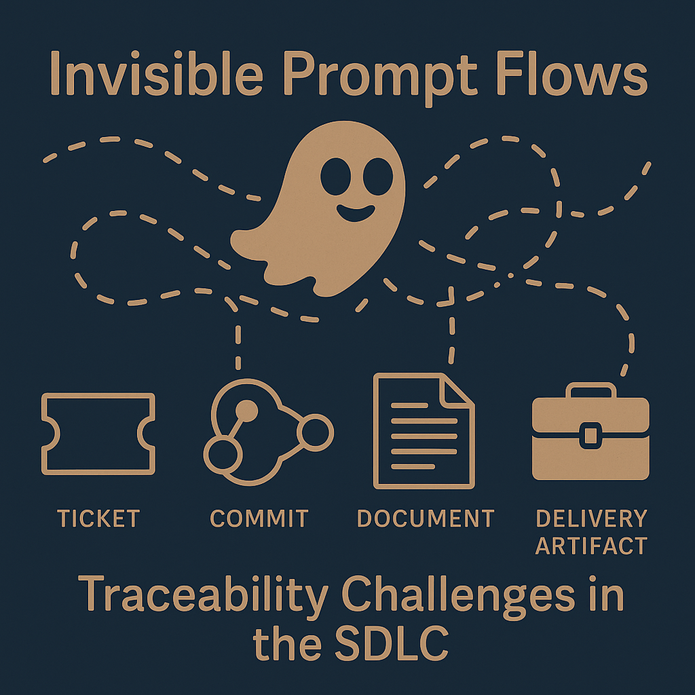

---
# automatic badge generation
lifecycle: rc
last_updated: "2025-08-15"
---

# Integrated Development Environment (IDE) Security



<p>
In the DoD context where <strong>auditability and traceability</strong> are compliance requirements, we must consider AI-augmented tools running <strong>inside the IDE</strong> (like Copilot, Tabnine, or CodeWhisperer). In this situation, traceability becomes more difficult because the interaction is often <strong>ephemeral and undocumented</strong> unless explicit controls are in place.
</p>

<p>
Here's how to <strong>address this gap</strong> architecturally and procedurally:
</p>

----

### Architectural and Governance Strategies for Prompt Traceability in IDE-Integrated Tools

#### 1. **IDE Plugin Instrumentation (Client-Side Logging)**

* Require IDE plugins to **log prompts and completions** locally with metadata:

  * Prompt text
  * File name and commit hash
  * Timestamp
  * User identity (e.g., Common Access Card-based auth)
* These logs should be **persisted to a secure location** or **telemetry pipeline** for centralized auditing.
* Ensure logs include linkage to relevant tickets (e.g., via Git branch naming conventions like `feature/JIRA-123`).

#### 2. **Prompt Logging Middleware or Agent**

* Insert a **middleware layer** (e.g., using HTTP proxies or local agents) that captures interactions between IDE and LLM services.
* Middleware can enrich requests with **SDLC context tags** (e.g., project ID, ATO boundary, classification level) before forwarding.

#### 3. **Model-Driven Trace Embedding**

* Encourage prompt templates that **include traceability anchors** directly in the prompt:

  ```
  # Prompt for JIRA-4321 | Branch: feature/encrypt-endpoint
  Generate Python code for encrypting form data using FIPS 140-2 compliant libraries.
  ```

#### 4. **Integration with CI/CD Audit Pipelines**

* Ensure prompts (or artifacts derived from prompts) are linked in:

  * Commit messages (`Generated with Prompt ID 78a2-LLM`)
  * PR descriptions or JIRA tickets
  * Build metadata (`.promptlog` files)
* Treat prompts like you would test cases or security scan reports: **curated, reviewed, and versioned**.

#### 5. **Mandate Use of Observability Tools**

* Recommend or require use of **prompt observability frameworks** like:

  * [LangSmith](https://www.langchain.com/langsmith)
  * [PromptLayer](https://www.promptlayer.com/)
  * [WandB](https://wandb.ai/)
* These tools can **track prompt lineage**, performance, and outcomes across environments (including IDE).

---

### DoD-Specific Recommendations

| Principle                     | Guidance                                                                |
| ----------------------------- | ----------------------------------------------------------------------- |
| **Zero Trust**                | Treat IDE plugins as boundary components. Log and monitor accordingly.  |
| **Traceability (DoD Ethics)** | Require attribution for any AI-assisted contribution.                   |
| **SP 800-53 Audit Control**   | Implement `AU-2`, `AU-6`, `AU-12` for logging and reviewing prompt use. |
| **DoDI 5000.82**              | Treat prompt templates as acquisition artifacts or reviewable assets.   |

----
