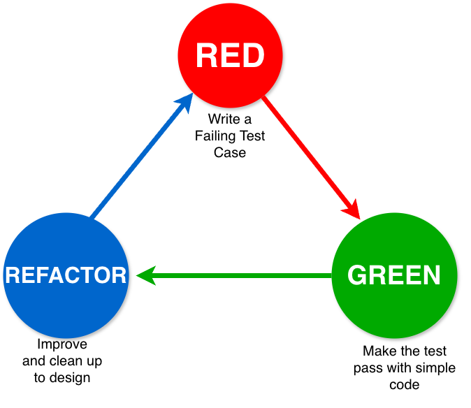

# Play: AI-Augmented Testing

### *“Testing as Continuous Assurance”*

> “Testing isn’t a phase—it’s how we earn trust in the pipeline.” — AI4SDLC Work Group

---

## Executive Summary (The Play in Brief)

Generative AI (GenAI) is redefining how software teams plan, design, and execute tests across the software development lifecycle (SDLC).  When used correctly, it amplifies coverage, speeds triage, and improves confidence in system behavior. When applied recklessly, it introduces new risks such as hallucinated assertions, loss of traceability, and decision fatigue.

This play defines **trusted, auditable practices** for applying GenAI within Department of War (DoW) and other high-assurance software environments. It builds on the [*Fundamentals*](fundamentals-play.md) and [*Requirements Engineering*](requirements_engineering_play.md) plays, emphasizing **secure augmentation**, **traceability**, and **evidence-as-code**.  The outcome is not automation for its own sake.  The outcome is improved quality and **continuous assurance** that aligns testing rigor with mission criticality.

📌 **Key takeaway:** Let the *requirements drive the tests*, not the source code.  Maintain human-in-the-loop validation to preserve trust, compliance, and mission assurance.

As described in the [Fundamentals Play](fundamentals-play.md), software health depends on continuous evidence of reliability, security, and resilience. AI-augmented testing improves these indicators and provides measurable input for AI software engineering evaluation criteria (AI-SWEC) based assessments. Early implementations within DoD—including the US Air Force's NIPRGPT system and GAO's pilot chatbot—demonstrate[^Wong24] that when applied with appropriate security controls and human oversight, GenAI-augmented testing can improve test accuracy by up to 57%, increase code coverage by 12%, and enhance bug detection by 24% compared to manual approaches.[^Yu24] These improvements directly address the persistent challenge that inadequate test coverage contributes to 29% of project failures, with 50-70% of defects remaining undetected until production in traditionally-tested systems.[^BS2024]

[^Wong24]: W. Wong, "Federal Agencies Experiment with Generative AI While Incorporating Safeguards," FedTech Magazine, Aug. 6, 2024. [Online]. Available: https://fedtechmagazine.com/article/2024/08/federal-agencies-experiment-generative-ai-while-incorporating-safeguards

[^Yu24]: J. Yu et al., "Measuring the Influence of Incorrect Code on Test Generation," arXiv preprint arXiv:2409.09464, 2024. [Online]. Available: https://arxiv.org/abs/2409.09464

[^BS2024]:BrowserStack, "How to Improve Automation Test Coverage," BrowserStack Guide, Oct. 22, 2024. [Online]. Available: https://www.browserstack.com/guide/improve-automation-test-coverage
<!--
TODO (Exec Summary):
-- add link to AI-SWEC-play.md when completed
-->

---

## 1. Why This Play Matters

Modern software delivery creates a fundamental tension: **velocity demands rapid iteration, but mission assurance demands rigorous validation**. The Department of War cannot sacrifice either. Traditional testing approaches cannot keep pace with DevSecOps velocity, yet testing remains the Department's primary defense against defects that erode operational readiness.

AI augmentation resolves this tension by enabling test engineers to:

- **Accelerate test creation** from requirements, specifications, and interface contracts without waiting for full implementations.
- **Generate realistic synthetic test data** that exercises edge cases, boundary conditions, and failure modes at scale.
- **Detect patterns in test failures** across CI/CD runs to identify flaky tests, environment drift, and emerging reliability risks.
- **Recommend coverage gaps** by analyzing production telemetry, incident reports, and system behavior under real-world conditions.

However, **speed without discipline becomes "testing amnesia"**—forgetting architectural intent, requirements linkage, or validation rigor. AI-generated tests that confirm implementation bugs rather than validate requirements create a false sense of assurance. This play ensures that testing with GenAI remains grounded in *mission assurance*, *risk awareness*, and *human accountability*.

Testing is not a gating function—it is a **continuous assurance signal** that strengthens software health throughout the lifecycle. As described in the [Fundamentals Play](fundamentals-play.md), software health depends on measurable indicators of reliability, resilience, observability, and security. GAI-augmented testing reinforces these indicators by increasing test coverage, improving consistency, generating validation evidence, and surfacing risks early enough to address them before deployment.

The Department of War's mission depends on software that performs correctly under all conditions. GenAI helps testers generate that assurance at the speed of modern delivery.

----

## 2. Purpose and Scope

This play provides structured guidance for applying GenAI to software testing in DoW and similar high-assurance ecosystems.

It addresses every major test type that can benefit from GenAI augmentation:

- **Unit Testing** – Validating individual functions in isolation with deterministic inputs and outputs
- **Integration Testing** – Validating behavior across component or service boundaries
- **System Testing** – Validating complete mission workflows end-to-end across the entire system
- **Regression Testing** – Ensuring code changes don't break existing functionality
- **Security Testing** – SAST, DAST, fuzzing, and security regression validation
- **Performance & Load Testing** – Validating responsiveness, throughput, and scalability under load
- **Test Data Generation** – Synthetic data creation for structured formats (JSON, XML, CSV)
- **Test Maintenance** – Flaky test detection and Infrastructure-as-Code validation
- **Test-Driven Development** – Using GenAI to support Red → Green → Refactor workflows

Each test type follows the same core principle: **requirements drive the tests, not the code**.

**Out of Scope**

- Full automation of testing removing humans from the loop
- Autonomous test acceptance
- Vendor-specific features
- Model fine-tuning
- GenAI infrastructure that is not compliant with DoW requirements
- Testing OF AI/ML systems (model validation, fairness testing, adversarial robustness)

This play focuses on testing WITH GenAI, not testing GenAI itself.

**Intended Audience:** Test leads, quality engineers, software engineers, DevSecOps integrators, cybersecurity assessors, and AOs.

This play complements existing DoW testing policy, IV&V practices, and accreditation activities and is not a substitute for any required procedures.

----

## 3. Prerequisites and Readiness

Before introducing GenAI-augmented testing, teams should demonstrate basic SDLC maturity:

- [ ] **Automated CI/CD pipeline** with reproducible builds and signed artifacts.
- [ ] **Requirements traceability** from user stories through validation (see [*Requirements Engineering Play*](requirements_engineering_play.md) ).
- [ ] **Secure environment** (IL-aligned enclave or approved on-prem capability).
- [ ] **Synthetic or anonymized data** ready for test data generation.
- [ ] **Prompt and evidence governance**: prompts and outputs logged for traceability (see [*Prompt Engineering Play*](prompt-engineering.md)).
- [ ] **Defined risk boundaries** for acceptable autonomy levels (see [*AI Autonomy Continuum Play*](ai-autonomy_continuum_play.md)).

📌 *Testing maturity is a precondition for safe GenAI adoption, and GenAI cannot compensate for weak discipline.*

If any of these prerequisites are not yet in place, teams should start GenAI-augmented testing in a narrow and low-risk scope, such as a single service or a small set of test cases. Initial work should remain in non-production environments with strict human review until the team strengthens its traceability, environment stability, and data handling practices.

----

## 4. Guiding Principles (or Guardrails)

| **Principle / Risk Area** | **Expected Practice** |
| -------------------------- | --------------------- |
| **Requirements-Driven Testing** | Tests must originate from requirements, not code. Prompts reference requirement artifacts to avoid bias. Requirements take precedence during evaluation. See the [Requirements Engineering Play](requirements_engineering_play.md)|
| **Data Exposure** | Never expose classified, PII, or CUI data to non-accredited models. Use synthetic data when testing with general-purpose models, or use models that are accredited for the appropriate impact level when handling real or mission-relevant data.
| **Prompt Leakage** | Treat entire prompt conversations as controlled artifacts. Sanitize all variables, logs, and identifiers throughout the conversation, not just in the first prompt, and remove any sensitive or mission-specific content before submission. See [Prompt Engineering Play](prompt-engineering.md)|
| **Model Provenance** | Record model name, version, and enclave in the AIBOM as part of test evidence. The AIBOM provides the traceability and documentation expected in the [NIST AI RMF](https://nvlpubs.nist.gov/nistpubs/ai/NIST.AI.100-1.pdf). |
| **Decision Accountability** | GenAI can suggest tests and summarize results, but only humans decide correctness and close findings. Test leads confirm alignment with requirements, determine whether failures reflect code or test issues, and review all GenAI-generated outputs as part of the evidence trail. |
| **Requirement-Based Assertion Validation** | Verify that GenAI-generated expected outcomes match requirements, not just the code's current behavior. Protect against "circular validation" where tests confirm implementation bugs rather than correct behavior.|
| **Containment** | Run GenAI-augmented testing inside approved network boundaries. Models must operate within the correct enclave, with egress controls that prevent data movement outside authorized paths. |
| **Human Oversight** | Test automation is human-directed today. GenAI augments testers rather than replacing them, although increasing autonomy and future advances in agentic orchestration may shift how much work can be delegated over time.   See the [AI Autonomy Continuum Play](ai-autonomy_continuum_play.md) for guidance on safe delegation. |
| **Synthetic Data Safety** | Synthetic data can still resemble real people or operational details. Review GenAI-generated datasets to ensure they do not mimic PII, mission entities, or realistic identities that could create privacy, compliance, or social engineering risks. Use constrained schemas or controlled dictionaries to limit unintended realism. |


These guardrails build on the foundations established in the AI4SDLC [Fundamentals Play](fundamentals-play.md). Each practice aligns with [DoW Zero Trust expectations](https://dodcio.defense.gov/Portals/0/Documents/Library/DoD-ZTStrategy.pdf) for least privilege and controlled data movement, the [NIST Secure Software Development Framework (SSDF)](https://csrc.nist.gov/projects/ssdf) for disciplined engineering workflows, and the DoD AI Risk Management Framework for transparency, traceability, and responsible use of GenAI models. Together they anchor testing in a security-first posture while supporting measurable software health.

### How to Apply These Guardrails in Practice

These guardrails should be applied during code reviews, CI/CD configuration, test planning, and environment setup.  Teams should document when guardrails are triggered, log exceptions, and incorporate the outputs into evidence-as-code repositories.  The goal is to maintain traceability and enable repeatable audits across environments.

<!-- TODO: Insert short AIBOM definition for provenance / NIST AI RMF alignment. -->
----

## 5. Core Patterns and Practices

This section provides foundational principles (5.1), brief overviews of each testing type (5.2–5.7), and guidance on additional testing practices (5.8–5.11). Deetailed guidance includes  example prompts, expected outputs, governance checklists, and tool integrations for testing types.

----

### 5.1 Requirements-Driven Testing

GenAI-augmented tests must begin with the requirement. The requirement is the source of truth, not the code. Code can have defects as well as not being holistic to the intent of a requirement.  For example, recent research shows 47% worse bug detection rate using test cases generated from poor code.[^TfromCode]
 Prompt models using informatoin from the requirement artifact (user story, Gherkin scenario, or acceptance table) to generate candidate test ideas.

[^TfromCode]: D. Huang, J. M. Zhang, M. Harman, M. Du, and H. Cui, “Measuring the Influence of Incorrect Code on Test Generation,” arXiv preprint arXiv:2409.09464, 2025, doi: 10.48550/arXiv.2409.09464.

> *Pattern Example:*
> “Given [requirement statement], generate [n] test cases that validate [behavior].”

#### Example Requirement and Candidate Tests

**Requirement:**
*“The system shall process approved requests within 3 seconds and log a warning if processing exceeds 5 seconds.”*

**GenAI-suggested tests (summarized):**

1. Processing completes ≤ 3 seconds. No warning log.
2. Processing between 3–5 seconds. Success, no warning log.
3. Processing > 5 seconds. Success and warning log present.

These are candidate test ideas. A human reviews and approves the test cases and test code that the LLMs generate.

#### Let requirements drive the tests

- Start every GenAI prompt from a requirement artifact: user story, acceptance criteria, Gherkin scenario, or requirement table.
- Include IDs or labels (for example, REQ-TR-102) so generated tests can be traced back to the requirement.
- Ask the model to generate tests in terms of expected behavior, not in terms of specific functions or class names.
- Avoid prompts that only describe the code. That creates circular validation where tests simply confirm the current implementation rather than the intended behavior.

#### Let requirements drive the outcome

When a test fails, use the model to help reason:

> *“Given the requirement and this failure, is the issue more likely in the test or in the implementation?”*

The requirement is the deciding source, not the model and not the code.

#### Clarify terminology

Models mirror ambiguity. Define terms like “unit,” “integration,” “journey,” or “scenario” in prompts so the generated tests match your team’s testing strategy. Be precise:

| Term | Common Interpretation | Better Prompting Approach |
|------|----------------------|---------------------------|
| Unit test | Any small test | Clarify isolation: "unit test for function X with mocked dependencies" |
| Integration test | Ambiguous (service? module? UI-API?) | Define boundaries: "API integration test" or "service-to-service integration" |
| System test | Full system test (UI → DB) | Name the workflow: "end-to-end user workflow for \<specific business process\>" |
| Regression test | Re-running all tests | Link to context: "regression test for bug fix \<ID\>" or "\<feature area\> regression suite" |
| Security test | Generic vulnerability scan | Choose the method: "SAST for \<vulnerability type\>" or "DAST attack scenario: \<scenario\>" |
| Performance test | Any speed test | Set conditions: "load test: \<N concurrent users\>" or "performance baseline: \<operation\>" |

**Vague prompt:** "Generate end-to-end tests for password reset"

**Precise prompt:** "Generate user journey tests for REQ-AUTH-047. Focus on user experience from reset request through successful login. Mock email delivery. Include token expiry and single-use security tests."

## 🚫 **Anti-Pattern: Code-Driven Test Generation**

When GenAI is prompted from the **code** instead of the **requirement**, it creates tests that only confirm the current implementation. This hides defects and breaks traceability.[^RBTG24]

[^RBTG24]: M. Karimi et al., "Requirements-Based Test Generation: A Comprehensive Survey," arXiv preprint arXiv:2505.02015v2, 2024. [Online]. Available: https://arxiv.org/html/2505.02015v2

**Example**

**GenAI prompt:**
“Generate tests for this function.”

**Output:**
Tests confirm what the code already does, not what the system is supposed to do.

**Problem:**
The tests all pass, yet the requirement may still be violated.
This creates false confidence and allows mission-critical failures to slip through.

**Why it matters:**
Tests must be requirement-driven. Code-driven testing turns GenAI into a mirror of the implementation instead of a validator of intended behavior. Research shows that while code-based test generation can identify implementation-level errors, it cannot address issues from earlier analysis or design phases. Critically, faulty code can mislead the test-generation process, causing defective implementations to bias automated test generation.


### 5.2 Unit Testing

Unit testing validates individual functions or modules in isolation. GenAI excels here because function signatures provide clear structure and requirements define expected behavior.

**Where GenAI helps:** Generating positive, negative, and boundary tests; suggesting edge cases; creating test scaffolding.

**What requires human validation:** Concurrency scenarios, resource cleanup, domain-specific business rules, requirement traceability.

📖 **[Full guidance: Unit Testing with GenAI →](testing-types/unit-testing.md)**

----

### 5.3 Integration Testing

Integration testing validates behavior across component or service boundaries. GenAI can generate API contract tests and error scenarios, but engineers must validate that tests reflect actual integration architecture and realistic failure modes.

**Where GenAI helps:** API contract validation; timeout and error handling scenarios; mock/stub generation; data consistency checks across boundaries.

**What requires human validation:** Actual service topology and dependencies; realistic network conditions; authentication/authorization flows; deployment environment constraints.

📖 **[Full guidance: Integration Testing with GenAI →](testing-types/integration-testing.md)**

----

### 5.4 System Testing

System testing validates complete mission workflows end-to-end across the entire system. GenAI can help identify test scenarios and generate test scripts, but operational realism and mission context require human expertise.

**Where GenAI helps:** End-to-end scenario generation; test script scaffolding; user journey mapping; acceptance criteria validation.

**What requires human validation:** Mission-critical workflow priorities; operational environment realism; cross-system dependencies; actual user behavior patterns.

📖 **[Full guidance: System Testing with GenAI →](testing-types/system-testing.md)**

----

### 5.5 Regression Testing

Regression testing ensures code changes don't break existing functionality. GenAI can identify which tests to run based on code changes, analyze failure patterns, and suggest new regression tests when bugs are fixed.

**Where GenAI helps:** Test selection based on code changes; failure pattern analysis across CI/CD runs; regression test generation from bug fixes; obsolete test identification.

**What requires human validation:** Risk-based test prioritization; root cause confirmation; test suite maintenance decisions; impact assessment on mission functionality.

📖 **[Full guidance: Regression Testing with GenAI →](testing-types/regression-testing.md)**

----

### 5.6 Security Testing

Security testing validates that systems resist attacks, protect sensitive data, and follow secure coding practices. GenAI assists with static analysis, dynamic testing scenarios, and fuzzing—but all security findings require expert validation.

**Where GenAI helps:** SAST vulnerability identification; DAST scenario generation; fuzzing seed creation; security regression tests; mapping findings to OWASP/CWE standards.

**What requires human validation:** Threat modeling and risk assessment; exploitability of findings; security control effectiveness; organizational security context; remediation prioritization.

📖 **[Full guidance: Security Testing with GenAI →](testing-types/security-testing.md)**

----

### 5.7 Performance and Load Testing

Performance testing validates system responsiveness, throughput, and scalability under realistic and extreme load conditions. GenAI can generate diverse load scenarios and detect performance regressions, but operational realism requires domain expertise.

**Where GenAI helps:** Load scenario generation; synthetic user profile diversity; performance regression detection; test data scaling; baseline analysis across runs.

**What requires human validation:** Realistic load profiles for operational environment; infrastructure constraints; bottleneck interpretation; mission impact assessment; resource utilization context.

📖 **[Full guidance: Performance and Load Testing with GenAI →](testing-types/performance-testing.md)**

----

### 5.8 Synthetic Test Data Generation

GenAI can generate diverse and controlled datasets for structured, text-based test data (JSON, XML, CSV). This approach protects mission information and helps teams explore edge cases and boundary conditions. However, **GenAI-generated synthetic data has sharp boundaries**—complex binary formats require deterministic scripts and specialized tooling. Never use real mission data with general-purpose models.

#### Current limitations

GenAI-generated synthetic data works best for structured, text-based formats (JSON, XML, CSV, simple tables) where correctness can be described declaratively. Complex binary formats—sensor telemetry, packets, images, byte-aligned messages governed by precise ICDs (byte order, bitfields, checksums, CRCs, framing, alignment)—should be generated using deterministic scripts and specialized tooling, not general-purpose GenAI models.

Attempting to use GenAI for byte-perfect binary payload generation introduces risks: incorrect checksums, alignment errors, endianness mismatches, and false confidence in data that appears correct but violates the ICD at the bit level.

#### Where GenAI works well for synthetic data

* **Structured text formats:** JSON, XML, CSV, YAML
* **Simple tabular data:** User records, transaction logs, configuration files
* **Edge case exploration:** Boundary values, invalid entries, missing fields, uncommon combinations
* **Schema-driven data:** When correctness can be described in terms of field types, ranges, and relationships
* **Value distribution proposals:** Suggesting ranges, distributions, and test scenarios based on requirements

#### When NOT to use GenAI for synthetic data

Do not rely on GenAI models to directly emit:

* Raw binary payloads from an ICD
* Data requiring exact checksums or CRCs at scale
* Sensor or packet streams where bit alignment, endianness, or byte padding is authoritative
* Images or media that could resemble real mission entities
* Any data where format correctness cannot be declared in text

#### When to use GenAI instead

GenAI can still support binary and complex data testing by:

* **Generating the binary encoder** (Python, Go, C, etc.) that will emit test frames according to the ICD
* **Proposing edge cases and value distributions** derived from the ICD specification
* **Creating golden test vectors** in human-readable forms (hex dumps, decoded field tables)
* **Generating schemas, message definitions, and constrained dictionaries** that feed deterministic generators
* **Drafting test harness scaffolding** for binary protocol validation

This approach keeps the GenAI in the design and scaffolding role while delegating byte-level correctness to deterministic tooling.

#### Example prompt

> *"Given this data schema, generate 10 synthetic examples, including boundary values, invalid entries, missing fields, and uncommon but valid combinations."*
>
> *Schema:*
> `{ "request_id": string, "priority": integer 1–5, "payload_weight": number, "origin": string, "destination": string }`

#### Example output (summarized)

* Valid cases at minimum and maximum priority
* Weight values at 0, extreme high values, and non-numeric types
* Missing origin or destination fields
* Invalid priority values such as 0, 6, or negative numbers

These examples feed unit or integration tests without exposing operational data.

#### Data storage and labeling

Store GenAI-generated synthetic datasets in the test repository with:

* a clear label such as `synthetic_v1`
* the prompt that produced the dataset
* model version and enclave
* a short description of the intended use

This preserves repeatability and provides traceability for audit and RMF documentation.

#### Watch for bias and gaps

Synthetic data can still be skewed.
Review GenAI-generated datasets to check for:

* unbalanced distributions
* unrealistic patterns
* overuse of default values
* missing negative or rare conditions

GenAI can help diversify the dataset, but a human reviewer confirms that the data reflects operational needs.

#### Important note on synthetic data

Synthetic data reduces risk, but it is not risk free. Models can generate names, locations, or patterns that resemble real people or mission contexts. Review all GenAI-generated datasets to confirm that they do not mimic real individuals, contain PII-like attributes, or produce highly realistic records that could be misinterpreted under privacy laws or used for social engineering. Use constrained schemas and controlled value dictionaries when possible to limit these risks.

----

### 5.9 Flaky-Test Detection and Triage

Flaky tests are automated tests that pass and fail inconsistently without code changes.  They are problematic because they erode confidence in CI/CD pipelines and waste engineering time. GenAI can help identify patterns in test flakiness and suggest root causes by analyzing test results across multiple runs.  This will aid delivery teams to have reliable tests.

#### What you need for pattern detection

Flaky-test detection requires historical data. GenAI cannot identify flakiness from a single test run. To detect patterns, you need:

- **Historical results** from multiple CI runs (at least 5-10 to identify patterns)
- **Consistent test identifiers** so the same test can be tracked across runs
- **Pass/fail status** and ideally error messages when tests fail
- **Execution metadata** like duration, timestamp, environment details

The format of this data matters. Structured formats work best, but raw logs can work with the right approach.

#### Recommended approach: Structured test result formats

Structured formats provide the most reliable foundation for GenAI analysis:

* **JUnit XML** - `pytest --junitxml=results.xml` or equivalent
* **JSON test reports** - `pytest --json-report`, `jest --json`
* **CI system APIs** - GitHub Actions, GitLab CI, Jenkins APIs that export test results
* **Test analytics platforms** - Allure, TestRail, ReportPortal, custom dashboards

**Why structured formats work better:**

- Consistent schema across all test runs
- Clear test identifiers that can be tracked over time
- Metadata (timestamps, duration, environment) is explicitly labeled
- Less ambiguity for GenAI to interpret

**Example: Working with structured data**

With JUnit XML or JSON results, GenAI can directly analyze patterns:

```json
{
  "test_runs": [
    {
      "run_id": "build-1234",
      "tests": [
        {"name": "test_login", "status": "passed", "duration": 1.2},
        {"name": "test_checkout", "status": "failed", "duration": 3.5,
         "error": "Timeout waiting for response"}
      ]
    },
    {
      "run_id": "build-1235",
      "tests": [
        {"name": "test_login", "status": "passed", "duration": 1.1},
        {"name": "test_checkout", "status": "passed", "duration": 2.1}
      ]
    }
  ]
}
```

**Prompt:**
> *"Analyze these test results from 10 CI runs. Identify tests with inconsistent outcomes, calculate failure rates, and suggest root causes based on error patterns and timing data."*

#### Alternative approach: Working with raw log files

If structured formats aren't available, GenAI can analyze raw CI/test logs—but with limitations.

**When raw logs work reasonably well:**

- Logs from test frameworks with consistent output format (pytest, Jest, JUnit, Go test)
- Test names appear reliably in the logs with clear pass/fail indicators
- Log files are focused on test execution (not mixed with extensive build/deployment output)
- File size is manageable (within GenAI context limits, typically under 100KB of relevant content)

**When raw logs are challenging:**

- Inconsistent formatting across different test runs or environments
- Mixed content (build logs, deployment steps, application logs, test results all interleaved)
- Very large files that exceed GenAI context windows
- Custom or proprietary log formats without clear structure

**Recommended two-step process for raw logs:**

1. **First, ask GenAI to parse and structure the data:**
   > *"Extract test results from these logs. For each test, identify the test name, pass/fail status, execution time, and any error messages. Present the results in JSON format."*

2. **Then, analyze the structured data:**
   > *"Analyze these test results from the last 10 runs. Identify tests with inconsistent pass/fail status and suggest likely root causes."*

This two-step approach helps GenAI focus on pattern recognition rather than struggling with log parsing.

#### Example: Analyzing raw pytest logs

**Step 1: Provide logs and ask for extraction**

```
Here are pytest logs from 5 recent CI runs:

[Paste log excerpts showing test output]

Extract test results into a table with columns: run_id, test_name, status, duration, error_message
```

**Step 2: Analyze the extracted data**

```
Based on these test results across 5 runs, identify:
1. Tests with inconsistent pass/fail status
2. Failure rate for each flaky test
3. Common error patterns
4. Likely root causes based on error messages and timing
```

#### What GenAI can identify

Given sufficient data (structured or successfully parsed logs), GenAI can surface:

- **Inconsistent results** - Tests that pass sometimes and fail other times
- **Timing patterns** - Tests that fail when duration exceeds a threshold
- **Error message clusters** - Common failure signatures (timeouts, connection errors)
- **Correlation hypotheses** - Failures that might correlate with environment, time, or load

#### Common root causes GenAI can suggest

- **Timing issues** - Sleep statements, race conditions, slow external calls
- **Shared state** - Global variables, reused mocks, leftover data between tests
- **Environment drift** - Configuration or dependency differences across runs
- **Order dependency** - Tests that only pass in a specific execution sequence
- **External dependency flakiness** - Unreliable calls to services or databases

**Important:** GenAI proposes hypotheses based on patterns. Engineers must validate root causes by reviewing test code and reproducing failures.

#### What GenAI cannot do reliably

- **Parse truly arbitrary logs** - Completely unstructured output with no patterns
- **Infer flakiness from a single run** - Pattern detection requires historical data
- **Fix flaky tests automatically** - Root cause resolution requires human judgment
- **Understand domain context** - GenAI doesn't know your system's operational behavior

#### Practical workflow

1. **Gather test data** - Structured test results (preferred) or raw logs from multiple runs
2. **If using raw logs** - Ask GenAI to extract structured test result data first
3. **Analyze for patterns** - Provide historical data and ask GenAI to identify flaky tests
4. **Review suggestions** - Validate GenAI hypotheses by examining test code and failures
5. **Fix root causes** - Engineers implement fixes based on confirmed root causes
6. **Track improvements** - Monitor failure rates in subsequent runs to verify fixes

#### Integration with test analytics tools

GenAI-generated insights work best when combined with test analytics platforms:

- **Test analytics dashboards** - Allure, ReportPortal, custom BI tools
- **Observability platforms** - Datadog, New Relic for performance correlation
- **CI system history** - GitHub Actions, GitLab CI, Jenkins build trends
- **Test result databases** - Storing pass/fail patterns over time

These tools can export both raw logs and structured data, giving you flexibility in how you feed information to GenAI while maintaining historical context.

----

### 5.10 Infrastructure-as-Code Validation

GenAI can assist with reviewing or proposing test-environment configurations written in Terraform, Kubernetes manifests, or CloudFormation templates. These suggestions can speed up environment creation, but all AI-generated IaC must be validated through approved security controls and policy-as-code tools.

#### Example prompt with Terraform

```terraform
resource "aws_s3_bucket" "test_logs" {
  bucket = "app-test-logs"
  acl    = "public-read"

  tags = {
    Environment = "test"
    Owner       = "teamA"
  }
}
```
> *“Review this Terraform module for test-environment use. Identify any security gaps, required tags, naming issues, and places where least-privilege or encryption should be applied.”*

#### What the model might surface

- Public bucket access when private access is required
- Missing server-side encryption
- Inconsistent or missing mandatory tags
- Noncompliant bucket name format
- Lack of IAM boundary or restrictive policies

#### Why policy-as-code still decides

GenAI can highlight problems and suggest improvements, but it can also propose:

- incorrect defaults
- insecure configurations
- syntactically valid but operationally unsafe patterns

Final validation must come from **policy-as-code tools** such as OPA, Conftest, or platform-level guardrails. These tools enforce:

- least privilege
- encryption defaults
- naming conventions
- resource isolation
- cost and resource limits

GenAI can accelerate IaC review, but approved guardrails determine what is allowed. Never apply AI-generated infrastructure code in mission environments without human review and enforcement through policy-as-code tools.

----

### 5.11 GenAI-Augmented Test-Driven Development (TDD)

GenAI can help teams adopt TDD by generating initial test scaffolds before code exists. This reinforces requirement alignment and produces traceable validation evidence early in the workflow.

#### TDD workflow with GenAI: Red → Green → Refactor

TDD is fundamentally a design discipline that drives quality through early validation.[^Farley] **The challenge:** GenAI models generate better tests when they can see code structure, but TDD requires writing tests *before* the code exists. The solution is to provide the GenAI with the requirement and the planned interface contract.

[^Farley]: D. Farley, *TDD Is The Best Design Technique*. Apr. 13, 2022. Accessed: Dec. 26, 2025. [Online Video]. Available: https://youtu.be/ln4WnxX-wrw



#### Step 1: Define the interface (even with no implementation)

Start with the requirement and a function signature:

```python
# Requirement REQ-TR-102: "The system shall process approved requests
# within 3 seconds and log a warning if processing exceeds 5 seconds."

def process_request(request: Request) -> ProcessResult:
    """
    Process an approved request and track timing.

    Args:
        request: Request object containing id, approval_status, payload

    Returns:
        ProcessResult with status, duration, and optional warning
    """
    pass  # Implementation to be written
```

#### Step 2: 🔴 RED - Generate failing tests with GenAI

**Prompt:**
> *"Generate unit tests for requirement REQ-TR-102 using this function signature. The implementation doesn't exist yet - generate tests that will validate the requirement when the code is written."*

GenAI generates tests based on the requirement + signature (not implementation, since it doesn't exist).

**Run the tests - they should fail:**

```bash
$ pytest test_process_request.py
FAILED - process_request() returns None, expected ProcessResult
```

#### Step 3: 🟢 GREEN - Write minimal implementation

Human engineer writes just enough code to make the tests pass:

```python
def process_request(request: Request) -> ProcessResult:
    if not request.approval_status:
        return ProcessResult(status="error", code="REQUEST_NOT_APPROVED")

    start = time.time()
    # ... actual processing logic ...
    duration = time.time() - start

    if duration > 5:
        log_warning("slow_processing_warning")

    return ProcessResult(status="success", duration=duration)
```

#### Step 4: 🔵 REFACTOR - Clean up while tests stay green

Refactor for clarity, performance, or maintainability. Tests ensure behavior doesn't break.

---

**Key principle:** Provide the GenAI with the **interface contract** (function signature, types, docstring) instead of implementation. This gives enough context to generate valid test structure without creating circular validation.

**Benefits of GenAI-augmented TDD:**

- Reduces the "blank page" problem when starting tests
- Suggests edge cases you might miss
- Speeds up the red-green-refactor cycle
- Maintains requirement traceability from the start

These generated tests still require human approval to ensure they reflect the requirement and the system's real interfaces.

#### Adopting TDD incrementally

Teams new to TDD do not need to start everywhere at once. GenAI can help ease the learning curve by:

- generating scaffolds for new features
- focusing on small, well-bounded functions
- supplementing (not rewriting) tests for legacy systems

GenAI can boost the early stages of TDD, but human oversight ensures that the practice remains disciplined and aligned with requirements. TDD is easier to introduce on new services than on legacy systems

----

## 6. Decision Framework and Trade-offs

GenAI-augmented testing spans multiple autonomy levels. The safe use of GenAI in testing depends on choosing the pattern that aligns with mission criticality, risk tolerance, and the maturity of the testing pipeline. See the [AI Autonomy Continuum Play](ai-autonomy_continuum_play.md) for the full description of autonomy patterns and how they apply across the SDLC.

The table below shows how common testing activities map to the autonomy patterns.

| **Use Case**                     | **GenAI Benefit**                          | **Risk**                     | **Recommended Pattern**                    |
| -------------------------------- | --------------------------------------- | ---------------------------- | ------------------------------------------ |
| Unit Test Generation             | Fast coverage for deterministic modules | Hallucinated logic           | Pattern 1: Assistive Tools                 |
| Integration Test Drafting        | Broader service coverage                | Schema mismatch              | Pattern 2: Delegated Agent                 |
| Test Data Synthesis              | Realistic and diverse data              | Potential leakage            | Pattern 3: Orchestrated System             |
| Continuous Validation Dashboards | Predictive QA metrics                   | False positives              | Pattern 3: Orchestrated System             |
| Autonomous Regression Repair     | Reduced manual maintenance              | High autonomy risk           | Pattern 4: Adaptive Ecosystem (pilot only) |
| Flaky-Test Analysis              | Faster triage and failure clustering    | Incorrect root-cause guesses | Pattern 1: Assistive Tools                 |

📌 *Select the autonomy pattern that matches mission criticality and risk tolerance. Calibrated trust is the goal, not fully automated autonomous activity without humans.*

#### Understanding Pattern 1 vs Pattern 4 in testing

**Pattern 1** supports engineers by proposing test ideas, identifying gaps, and summarizing logs. The human remains fully responsible for what is accepted into the test suite.

**Pattern 4** involves GenAI modifying tests or repairing regression failures without direct human initiation. This level should only be explored in controlled pilots with strict guardrails, policy enforcement, and rollback paths.

Pattern 1 helps teams move faster without changing governance.
Pattern 4 changes both workflow and governance and must be adopted slowly and deliberately.

----

### 💡 How Autonomy Patterns Strengthen Software Health

> The autonomy pattern you choose affects core dimensions of software health.
>
> **Pattern 1** supports *reliability* by improving test clarity and identifying missing coverage.
> **Pattern 2** strengthens *observability* by exposing integration paths and cross-service behaviors.
> **Pattern 3** improves *resilience* by exercising diverse conditions and revealing edge-case failures.
> **Pattern 4** requires the most caution because it influences all dimensions and should be limited to controlled pilots until guardrails and rollback strategies are validated.
>
> This aligns with the [Fundamentals Play](fundamentals-play.md) guidance that software health improves when autonomy is applied deliberately and backed by evidence.


## 7. Implementation Guidance (How to Start)

1. **Pilot** – Begin with a single microservice or a small, well-defined test set.
2. **Measure** – Track changes in coverage, defect escape rate, and confidence gain.
3. **Calibrate Trust** – Compare GenAI-suggested results to human baselines and log discrepancies for review.
4. **Iterate** – Refine prompts, adjust patterns, and evaluate different IL-approved models as you learn.
5. **Share and Reuse** – Contribute prompts, patterns, and lessons learned to the AI4SDLC repository.

📊 *Quantitative metrics should feed into the AI-SWEC framework and also support software health dashboards.*

#### Example Pilot (short reference scenario)

A small team working on a logistics microservice at IL4 introduced GenAI-augmented test generation for new endpoints. They started with one requirement at a time and generated candidate tests using an IL-approved model. The team reviewed and refined the suggested tests during pull requests. After two sprints they recorded a measurable increase in coverage, reduced triage time for flaky tests, and clearer traceability from requirements to test results.

<!--
TODO (Implementation Guidance):
- Optionally tie into specific environments (e.g., Party Bus AI gateway, internal AI platforms) if appropriate for DoW context.
-->

*This lightweight approach keeps the pilot small, measurable, and safe while building trust and evidence before expanding to more services or higher autonomy patterns.*

----

## 8. Key Considerations (Risks, Metrics, Pitfalls)

#### Common Risks
- **Hallucinated Assertions:** Tests that verify behaviors the system never intended to support.
- **Prompt Drift:** Slightly different wording produces inconsistent tests, which can erode trust.
- **False Confidence:** Teams may assume AI-generated tests are correct without reviewing them.
- **Signal Confusion:** Too much AI-generated output can overwhelm reviewers and bury important findings.

#### Risk Mitigation (Quick Reference)

| **Risk** | **Mitigation** | **Related Play** |
|---------|----------------|------------------|
| Hallucinated Assertions | Require human approval and tie every test to a requirement ID | [Requirements Engineering](requirements_engineering_play.md) |
| Prompt Drift | Use prompt templates and store conversations for audit and reuse | [Prompt Engineering](prompt-engineering.md) |
| False Confidence | Maintain human decision authority and log discrepancies | [Autonomy Continuum](ai-autonomy_continuum_play.md) |
| Signal Confusion | Limit generation scope and use tagging or metadata to prioritize tests | [Fundamentals](fundamentals-play.md) |

#### Key Metrics and Why They Matter

- **Test coverage improvement (%)** - Higher coverage improves reliability and supports healthier, more predictable releases.

- **Defect escape rate reduction (%)** - A direct indicator of reliability and mission assurance. Lower escape rates mean the tests are doing the real work.

- **Mean Time to Detect (MTTD)** - Faster detection improves observability and supports resilient operations.

- **Mean Time to Repair (MTTR)**  - Shorter MTTR reflects stronger feedback loops and more efficient engineering workflows.

- **Ratio of human vs. AI-generated test cases used in production** - Helps teams understand how autonomy is being applied and where additional review is needed.

- **Review cadence** - Examine these metrics at least once per release cycle to understand how GenAI-augmented testing is affecting reliability and mission assurance.

Each of these metrics strengthens one or more dimensions of software health and should be reviewed regularly to understand how GenAI-augmented testing is shaping outcomes.

----

## 9. Key Takeaways

- Testing is a **continuous assurance** function, not a post-development activity.
- **Requirements drive tests**, not the source code.
- **GenAI augments testers** and does not replace their judgment.
- Every GenAI output becomes **evidence-as-code** and must be traceable and auditable.
- Balance **speed**, **security**, and **mission assurance** at every step.
- In the DoW context, testing is where we protect mission outcomes from silent failure.

----

## 10. Companion Plays and References

#### Related AI4SDLC Plays

- [Fundamentals for Building an AI-Augmented Toolchain](fundamentals-play.md)
- [Requirements Engineering](requirements_engineering_play.md)
- [Prompt Engineering](prompt-engineering.md)
- [Leading Practices for Code Completion and Generation](code-gen-play.md)
- [Navigating the AI Autonomy Continuum](ai-autonomy_continuum_play.md)

These companion plays provide the foundational guardrails, prompting practices, requirement structures, and autonomy patterns that this Testing Play builds upon.

#### Key References

- [NIST Secure Software Development Framework (SSDF) – SP 800-218](https://csrc.nist.gov/pubs/sp/800/218/final)
- [DoD Enterprise DevSecOps Reference Design v1.0](https://dodcio.defense.gov/Portals/0/Documents/DoD%20Enterprise%20DevSecOps%20Reference%20Design%20v1.0_Public%20Release.pdf)
- [NIST AI Risk Management Framework (AI RMF)](https://nvlpubs.nist.gov/nistpubs/ai/NIST.AI.100-1.pdf)

These documents shape the security, assurance, and governance expectations that AI-augmented testing must align to within high-assurance and DoW environments.

----

 **End of Play**

